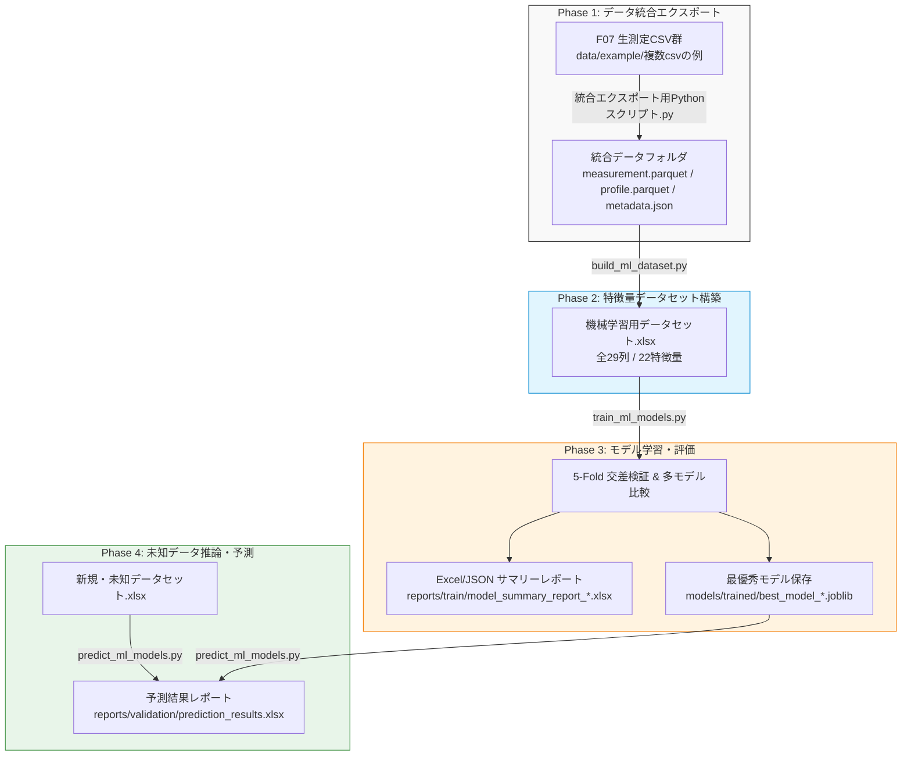

# TAT異常検知 全体ワークフロー概要

本ドキュメントでは、F07装置出力の生CSVデータの統合から、7つの測光ポイント濃度再計算＆特徴量生成、機械学習モデルの構築・自動評価、および未知データに対する予測結果出力までの**全体ワークフローとシステム構造**について解説します。

---

## 1. 全体アーキテクチャフロー図

本システムは、4つの独立かつ連動したフェーズで構成されています。



---

## 2. 各フェーズと担当スクリプト一覧

| フェーズ | 役割・機能 | 実行スクリプト | 詳細取扱説明書 |
|---|---|---|---|
| **Phase 1** | **データ統合エクスポート**<br>複数生CSVの個別パース、ヌルバイト除去、ユニークID付与、Parquet化 | `scripts/data-manage/統合エクスポート用Pythonスクリプト.py` | [dataset_building_guide.md](file:///Users/hiranotakahiro/Desktop/TAT_outlier_detection/docs/dataset_building_guide.md) |
| **Phase 2** | **特徴量データセット構築**<br>7測光Pt濃度再計算、統計量・比率算出、全29列Excel出力 | `scripts/data-manage/build_ml_dataset.py` | [dataset_building_guide.md](file:///Users/hiranotakahiro/Desktop/TAT_outlier_detection/docs/dataset_building_guide.md) |
| **Phase 3** | **モデル学習・交差検証**<br>動的正解ラベル定義、分類/回帰マルチモデル評価、選定モデル保存 | `scripts/train/train_ml_models.py` | [ml_training_guide.md](file:///Users/hiranotakahiro/Desktop/TAT_outlier_detection/docs/ml_training_guide.md) |
| **Phase 4** | **未知データ推論・予測**<br>保存済みモデルロード、新規データの自動推論、予測結果Excel出力 | `scripts/validate/predict_ml_models.py` | [ml_prediction_guide.md](file:///Users/hiranotakahiro/Desktop/TAT_outlier_detection/docs/ml_prediction_guide.md) |

---

## 3. ディレクトリ構造と成果物の配置

本プロジェクトの標準ディレクトリレイアウトは以下の通りです。

```text
TAT_outlier_detection/
├── data/                            # データ保持フォルダ
│   ├── dictionary/                  # 特徴量スキーマ定義 (high_deviation_dataset_config.json)
│   └── example/                     # サンプルデータ・入力/出力データセット
│       ├── 複数csvの例/             # 生CSV格納フォルダ
│       ├── integrated_export/       # Phase 1 出力 (parquet/csv/json)
│       └── 機械学習用データセット.xlsx # Phase 2 出力 (学習用データセット)
├── docs/                            # 各種取扱説明書ドキュメント
│   ├── workflow_overview.md         # 全体ワークフロー概要 (本ドキュメント)
│   ├── dataset_building_guide.md    # データセット構築の取説
│   ├── ml_training_guide.md         # モデル学習＆評価の取説
│   └── ml_prediction_guide.md       # 未知データ予測の取説
├── models/                          # モデル保存フォルダ
│   └── trained/                     # Phase 3 出力 (.joblib モデル)
├── reports/                         # レポート出力フォルダ
│   ├── train/                       # Phase 3 出力 (学習評価サマリー Excel/JSON)
│   └── validation/                  # Phase 4 出力 (予測結果 Excel)
└── scripts/                         # 実行Pythonスクリプト
    ├── data-manage/                 # データ管理・構築スクリプト
    │   ├── 統合エクスポート用Pythonスクリプト.py
    │   └── build_ml_dataset.py
    ├── train/                       # モデル学習スクリプト
    │   └── train_ml_models.py
    └── validate/                    # 推論・予測スクリプト
        └── predict_ml_models.py
```

---

## 4. クイックスタート (パイプラインの順次実行)

すべてのスクリプトは、設定エリアのデフォルト指定により**コマンドライン引数なし**でそのまま順次実行可能です。

```bash
# 1. 生CSVの統合＆Parquet変換 (Phase 1)
python scripts/data-manage/統合エクスポート用Pythonスクリプト.py

# 2. 機械学習用特徴量データセットの構築 (Phase 2)
python scripts/data-manage/build_ml_dataset.py

# 3-a. 分類モデルの学習＆評価サマリー生成 (Phase 3: 分類)
python scripts/train/train_ml_models.py --task-type classification

# 3-b. 回帰モデルの学習＆評価サマリー生成 (Phase 3: 回帰)
python scripts/train/train_ml_models.py --task-type regression

# 4. 保存モデルを用いた未知データの推論・予測結果出力 (Phase 4)
python scripts/validate/predict_ml_models.py
```

---

## 5. 設計思想と特長

1. **カスタマイズ容易性 (設定エリア構造)**:
   - 全スクリプトのファイル最上部（15〜30行目付近）に直感的な【設定エリア】を設けており、パス変更や正解ラベル（目的変数）の動的定義をコード冒頭の数行を修正するだけで変更可能です。
2. **データの堅牢性・クリーニング**:
   - 生CSVに含まれる可能性があるヌルバイト (`\x00`) や数値変換時の例外、欠損値を自動検知して安全に処理します。
3. **高品質なExcelレポート機能**:
   - 出力されるすべての Excel 成果物には、視認性の高いテーブル装飾、数値フォーマット、自動列幅調整、フリーズペイン（ヘッダー固定）が自動適用されます。
